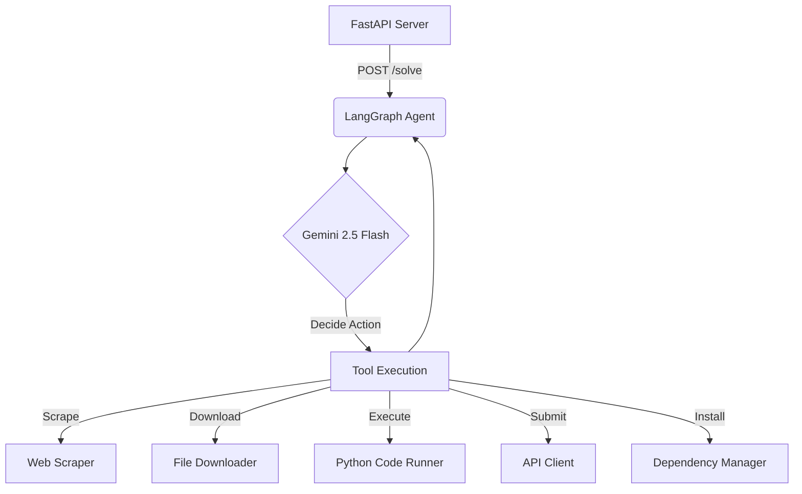

# 🤖 LLM-Powered Autonomous Quiz Solver

[](https://opensource.org/licenses/MIT)
[](https://www.python.org/downloads/)
[](https://fastapi.tiangolo.com/)

Welcome to the **LLM Analysis Quiz Solver**, a sophisticated autonomous agent capable of solving multi-stage data science quizzes. By leveraging **LangGraph** for orchestration and **Google's Gemini 2.5 Flash** for reasoning, this system can navigate the web, process complex data, and perform analysis without human intervention.

---

## � Contents

- [Project Overview](#-project-overview)
- [System Architecture](#-system-architecture)
- [Key Features](#-key-features)
- [Directory Structure](#-directory-structure)
- [Getting Started](#-getting-started)
- [Configuration](#-configuration)
- [Running the Application](#-running-the-application)
- [API Reference](#-api-reference)
- [Available Tools](#-available-tools)
- [Deployment](#-deployment)
- [Workflow Logic](#-workflow-logic)

---

## 🔍 Project Overview

Designed for the **Tools in Data Science (TDS)** course, this application addresses the challenge of autonomous problem-solving. The agent interacts with a quiz server to:

1.  **Navigate**: Traverse through a series of linked quiz pages.
2.  **Acquire Data**: Scrape web content, fetch APIs, and download resources.
3.  **Process**: Clean and format data from sources like CSVs, PDFs, and images.
4.  **Analyze**: Apply statistical methods and machine learning via generated Python code.
5.  **Visualize**: Create charts and interpret results to answer questions.

The system is built to be robust, handling errors and dynamic content (like JavaScript-rendered pages) gracefully.

---

## 🏗️ System Architecture

The core of the application is a **LangGraph State Machine** that manages the flow between the LLM and various tools.



### Core Components

*   **FastAPI Interface** (`main.py`): The entry point for external requests, handling validation and background task triggering.
*   **Orchestrator** (`agent.py`): The brain of the operation, maintaining state and directing the LLM.
*   **Toolbelt** (`tools/`): A collection of specialized functions for interacting with the world.
*   **Intelligence**: Google's Gemini 2.5 Flash model, optimized for speed and reasoning.

---

## ✨ Key Features

*   **🔗 Multi-Stage Solving**: Capable of following a chain of quiz URLs to completion.
*   **🖥️ Dynamic Scraping**: Utilizes **Playwright** to handle modern, JavaScript-heavy websites.
*   **🐍 Code Execution**: Generates and runs Python scripts in a sandboxed environment for complex analysis.
*   **📂 Versatile Data Handling**: Supports downloading and processing of various file formats.
*   **📦 Auto-Dependency Management**: Detects and installs missing Python packages on the fly.
*   **🛡️ Resilient Design**: Implements retries and error handling to recover from failures.
*   **🐳 Docker Ready**: Fully containerized for easy deployment to cloud platforms like HuggingFace Spaces.
*   **⏱️ Rate Aware**: Built-in throttling to respect API limits.

---

## 📁 Directory Structure

```text
LLM-Analysis-TDS-Project-2/
├── agent.py                    # Core logic for the LangGraph agent
├── main.py                     # FastAPI application entry point
├── pyproject.toml              # Dependency definitions
├── Dockerfile                  # Container configuration
├── .env                        # Local secrets (excluded from git)
├── tools/                      # Capability modules
│   ├── web_scraper.py          # HTML extraction via Playwright
│   ├── code_generate_and_run.py # Python execution engine
│   ├── download_file.py        # Resource fetcher
│   ├── send_request.py         # API interaction tool
│   └── add_dependencies.py     # Package manager wrapper
└── README.md                   # Project documentation
```

---

## 📦 Getting Started

### Prerequisites

*   **Python 3.12+**
*   **uv** (Recommended for speed) or `pip`
*   **Git**

### Installation

1.  **Clone the repository:**
    ```bash
    git clone https://github.com/23f3004115/LLM-PROJECT-2.git
    cd LLM-PROJECT-2
    ```

2.  **Install dependencies:**

    *Using `uv` (Fast & Recommended):*
    ```bash
    pip install uv
    uv sync
    uv run playwright install chromium
    ```

    *Using `pip` (Standard):*
    ```bash
    python -m venv venv
    # Activate: .\venv\Scripts\activate (Windows) or source venv/bin/activate (Mac/Linux)
    pip install -e .
    playwright install chromium
    ```

---

## ⚙️ Configuration

Create a `.env` file in the root directory to store your sensitive credentials:

```ini
# User Credentials
EMAIL=your.email@example.com
SECRET=your_secret_token

# AI Provider
GOOGLE_API_KEY=your_gemini_api_key
```

> **Note:** You can obtain a Gemini API key from [Google AI Studio](https://aistudio.google.com/app/apikey).

---

## 🚀 Running the Application

### Local Server

Launch the FastAPI server using your preferred method:

```bash
# With uv
uv run main.py

# With python
python main.py
```

The server will be accessible at `http://0.0.0.0:7860`.

### Verifying the Setup

You can test the system by sending a request to the local endpoint:

```bash
curl -X POST http://localhost:7860/solve \
  -H "Content-Type: application/json" \
  -d '{
    "email": "your.email@example.com",
    "secret": "your_secret_token",
    "url": "https://tds-llm-analysis.s-anand.net/demo"
  }'
```

If successful, you will receive a `{"status": "ok"}` response, and the agent will begin processing in the background.

---

## 🌐 API Reference

### `POST /solve`

Initiates the autonomous solving process.

**Payload:**
```json
{
  "email": "user@example.com",
  "secret": "secure_token",
  "url": "https://target-quiz.com/start"
}
```

**Status Codes:**
*   `200 OK`: Request accepted, agent started.
*   `403 Forbidden`: Invalid credentials.
*   `400 Bad Request`: Malformed input.

### `GET /healthz`

Simple health check to verify server status.

**Response:**
```json
{
  "status": "ok",
  "uptime_seconds": 120
}
```

---

## 🛠️ Available Tools

The agent utilizes a suite of specialized tools to accomplish its tasks:

| Tool | Function | Description |
| :--- | :--- | :--- |
| **Web Scraper** | `get_rendered_html` | Fetches fully rendered HTML using Playwright, ensuring dynamic content is captured. |
| **Downloader** | `download_file` | Retrieves files (PDF, CSV, etc.) and saves them locally for processing. |
| **Code Runner** | `run_code` | Executes Python code to perform data analysis, math, or file manipulation. |
| **API Client** | `post_request` | Submits answers to the quiz server and handles response logic. |
| **Pkg Manager** | `add_dependencies` | Installs missing Python libraries on-demand using `uv`. |

---

## 🐳 Deployment

### Docker

Build and run the application in a containerized environment:

1.  **Build:**
    ```bash
    docker build -t quiz-solver-agent .
    ```

2.  **Run:**
    ```bash
    docker run -p 7860:7860 \
      -e EMAIL="your_email" \
      -e SECRET="your_secret" \
      -e GOOGLE_API_KEY="your_key" \
      quiz-solver-agent
    ```

### HuggingFace Spaces

This project is optimized for HuggingFace Spaces. simply:
1.  Create a new Space (Docker SDK).
2.  Push the code.
3.  Set your `EMAIL`, `SECRET`, and `GOOGLE_API_KEY` in the Space's **Settings > Variables and secrets**.

---

## 🧠 Workflow Logic

The agent operates on a loop until the task is complete:

1.  **Analyze**: The LLM examines the current state and instructions.
2.  **Plan**: It decides which tool is best suited for the immediate step.
3.  **Execute**: The selected tool is run (e.g., scraping a page).
4.  **Evaluate**: The output is analyzed. If an answer is found, it is submitted.
5.  **Iterate**: If the submission reveals a new URL, the process repeats. If finished, the agent terminates.

---

## 📄 License

This project is open-source and available under the **MIT License**.

**Author**: Pardhiv Nukasani
**Context**: IIT Madras - Tools in Data Science
